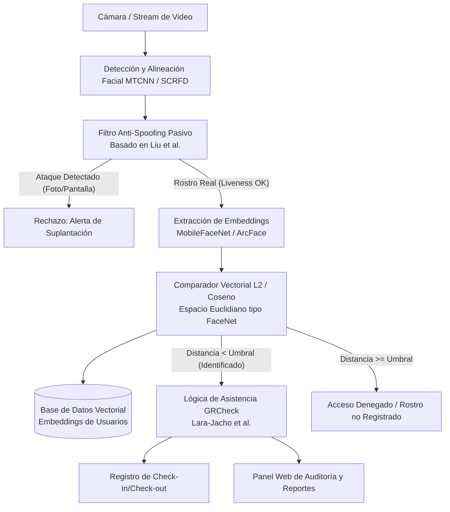

# Investigación Académica sobre Reconocimiento Facial y Propuesta para GRCheck

Este documento reúne la investigación del estado del arte en tecnologías de reconocimiento facial basadas en literatura académica indexada en **Google Académico && Repositorios de el MIT y otras Universidades** (priorizando artículos seminales en inglés y complementando con aplicaciones prácticas en español). A partir de los mejores aportes de estos 5 proyectos, se define la arquitectura y funcionalidades del nuevo sistema **GRCheck**.

---

## 1. Tabla Comparativa de Proyectos y Aportes a GRCheck

| Artículo | Lista de funcionalidades | Qué llevará GRCheck |
| :--- | :--- | :--- |
| **FaceNet: A Unified Embedding for Face Recognition and Clustering**  **Autores:** Florian Schroff, Dmitry Kalenichenko, James Philbin (Google Inc.) **Año:** 2015 **Publicación:** *IEEE CVPR*, pp. 815–823. 📄 [PDF Local](FaceNet_Schroff_2015.pdf) \| 🔗 [OpenAccess CVF](https://openaccess.thecvf.com/content_cvpr_2015/html/Schroff_FaceNet_A_Unified_2015_CVPR_paper.html) \| [arXiv:1503.03832](https://arxiv.org/abs/1503.03832) | • Mapeo directo de imágenes de rostros a un espacio euclidiano compacto de 128/512 dimensiones (*embeddings*). • Función de pérdida *Triplet Loss* con minería en línea de casos difíciles (*hard triplet mining*). • Comparación de similitud mediante distancia euclidiana L2 o coseno en milisegundos. • Verificación 1:1 y agrupamiento/búsqueda 1:N escalable sin clasificadores intermedios complejos. | **Motor de Representación Vectorial y Búsqueda Rápida:** Mapeo de cada rostro a un vector numérico (embedding) compacto almacenado en base de datos. Comparación por distancia métrica en milisegundos para identificar o verificar personas al instante sin reentrenar la red. |
| **ArcFace: Additive Angular Margin Loss for Deep Face Recognition**  **Autores:** Jiankang Deng, Jia Guo, Niannan Xue, Stefanos Zafeiridou (InsightFace / Imperial College London) **Año:** 2019 **Publicación:** *IEEE/CVF CVPR*, pp. 4690–4699. 📄 [PDF Local](ArcFace_Deng_2019.pdf) \| 🔗 [OpenAccess CVF](https://openaccess.thecvf.com/content_CVPR_2019/html/Deng_ArcFace_Additive_Angular_Margin_Loss_for_Deep_Face_Recognition_CVPR_2019_paper.html) \| [arXiv:1801.07698](https://arxiv.org/abs/1801.07698) | • Función de pérdida con margen angular aditivo (*Additive Angular Margin*) proyectada en una hiperesfera geodésica. • Maximización de la separación inter-clase y compacidad intra-clase para discriminación de alta fidelidad. • Gran robustez ante variaciones severas de pose (ángulos oblicuos), cambios de iluminación y oclusiones parciales (gafas, mascarillas). | **Módulo de Discriminación Angular de Alta Precisión:** Utilización de modelos de extracción basados en ArcFace (ej. InsightFace/ONNX) para garantizar reconocimiento preciso cuando los usuarios miran la cámara en ángulos imperfectos, con iluminación deficiente o en movimiento. |
| **Learning Deep Models for Face Anti-Spoofing: Binary or Auxiliary Supervision**  **Autores:** Yaojie Liu, Amin Jourabloo, Xiaoming Liu (Michigan State University) **Año:** 2018 **Publicación:** *IEEE CVPR*, pp. 389–398. 📄 [PDF Local](Face_Anti_Spoofing_Liu_2018.pdf) \| 🔗 [OpenAccess CVF](https://openaccess.thecvf.com/content_cvpr_2018/html/Liu_Learning_Deep_Models_CVPR_2018_paper.html) \| [DOI: 10.1109/CVPR.2018.00041](https://doi.org/10.1109/CVPR.2018.00041) | • Detección de vivacidad pasiva (*Passive Face Anti-Spoofing*) mediante supervisión auxiliar multivariable. • Estimación en tiempo real de mapas de profundidad 3D del rostro y análisis de pulso cardíaco facial (fotopletismografía remota / rPPG). • Detección eficaz contra ataques de presentación: fotos impresas, pantallas de smartphones/tablets, monitores y máscaras 2D. | **Módulo de Seguridad Anti-Suplantación (Anti-Spoofing Pasivo):** Verificación automática de prueba de vida antes de registrar la asistencia, impidiendo fraudes con fotos o vídeos desde dispositivos móviles sin necesidad de que el usuario haga gestos forzados. |
| **MobileFaceNets: Efficient CNNs for Accurate Real-Time Face Verification on Mobile Devices**  **Autores:** Sheng Chen, Yang Liu, Xiang Gao, Zhen Han (AuthenMetric / CAS) **Año:** 2018 **Publicación:** *Biometric Recognition. CCBR 2018. Springer*, pp. 428–438. 📄 [PDF Local](MobileFaceNets_Chen_2018.pdf) \| 🔗 [Springer](https://doi.org/10.1007/978-3-319-97909-0_46) \| [arXiv:1804.07573](https://arxiv.org/abs/1804.07573) | • Arquitectura de red neuronal ultraligera basada en convoluciones separables y *Global Depthwise Convolution* (GDConv). • Modelo extremadamente compacto (< 1 millón de parámetros, peso aproximado de ~4 MB). • Latencia de inferencia menor a 30 ms en procesadores embebidos o móviles (CPU/NPU ARM) con consumo energético mínimo. | **Motor de Inferencia Ligera (Edge Computing / Offline):** Capacidad de desplegar el motor de captura y comparación en terminales de bajo costo (tablets, Raspberry Pi, teléfonos) mediante cuantización ONNX Runtime, operando localmente sin latencia y con tolerancia a caídas de Internet. |
| **Prototipo de reconocimiento facial para mejorar el control de asistencia de estudiantes**  **Autores:** Sandra Lorena Lara-Jacho, Omar Albarracín-Zambrano, Diana V. Ponce-Ruiz **Año:** 2020 **Publicación:** *Revista Arbitrada Interdisciplinaria Koinonía*, 5(10), 405–427. 📄 [PDF Local](Control_Asistencia_Lara_2020.pdf) \| 🔗 [Dialnet](https://dialnet.unirioja.es/servlet/articulo?codigo=7608931) \| [DOI: 10.35381/r.k.v5i10.697](https://doi.org/10.35381/r.k.v5i10.697) | • Flujo operativo de registro automatizado de asistencia y control horario. • Panel administrativo para gestión de usuarios, horarios de turnos, tolerancias de tardanza y reportes. • Directrices sobre aceptación del usuario, consideraciones de privacidad biométrica y respaldo documental. | **Módulo de Gestión de Asistencia, Reportes y Privacidad:** Lógica de negocio completa de control de personal (registro de entrada/salida con timestamp, cálculo de retardos/faltas, auditoría, dashboard gerencial y almacenamiento anónimo que resguarda únicamente el vector matemático, sin exponer fotos sensibles). |

---

## 2. Arquitectura Conceptual del Sistema GRCheck

El sistema **GRCheck** unifica los 5 pilares extraídos de la investigación en un flujo continuo y seguro:

### Componentes Clave de GRCheck:

1. **Ingesta y Detección en el Borde (Edge-First):** Inferencia optimizada con ONNX Runtime sobre CPU/NPU local.
2. **Seguridad Biométrica:** Liveness pasivo para prevenir fraudes sin degradar la experiencia de usuario.
3. **Discriminación Facial Robusta:** Resistencia a iluminación dinámica, mascarillas o ángulos de paso gracias a la formulación angular de ArcFace.
4. **Almacenamiento Seguro:** No se almacenan fotos crudas de los usuarios en producción, únicamente los vectores normalizados de 512 flotantes protegidos con cifrado.
5. **Capa de Negocio:** API de gestión de turnos, asistencia, justificaciones y reportería para recursos humanos o instituciones educativas.

### Funciones Extra (Originalidad)

1. **Integracion automatica de nomina:** Se podra programar bonos de puntualidad y ver una grafica de todos los usuarios que tanto faltan 
2. **Graficas de Productividad:** Se podra visualizar los dias mas productivos menos anomalias reportes de que falte alguien, mensajes auitomaticos en caso de que falte
3. **CRM:** Un crm basico para el control de la compñia, despues en la version 2 sera mas avanzado
4. **Notificar a usuarios de la plataforma mediante mensajes del ceo**
5. **lista de tareas pendientes**
6. **pase de lista por login biometrico**
7. **control de ubicacion por si el equipo sale de la compañia**
8. **corte de caja automatico y envios programados cada mes por Email || WhatsApp || Telegram**
9. **Analisis de Resultados Aytomatico**
10. **control y panel movil de contrabilidad**
11. **Sistema de Actualizaciones por VPS**
12. **Permisos y Rangos:** solo se les hablita los modulos permitidos a los permmisos